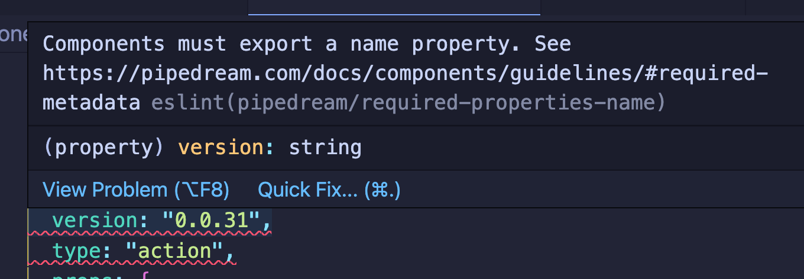

# eslint-plugin-pipedream

This ESLint plugin implements rules that validate the [Pipedream component guidelines](https://pipedream.com/docs/components/guidelines/#guidelines-patterns). Only a subset of the guidelines are mapped to rules: those that can be statically-analyzed.

For example, all components should have a `name`:



Learn more about Pipedream at [https://pipedream.com/docs](https://pipedream.com/docs), and read more about Pipedream components in [the component API docs](https://pipedream.com/docs/components/api/).

We will gladly accept issues and PRs in this repo.

## Installation

In the repo where you manage Pipedream components, run:

```bash
npm install eslint-plugin-pipedream --save-dev
```

Then add the Pipedream plugin to the `plugins` section of your [ESLint config file](https://eslint.org/docs/user-guide/configuring/):

```javascript
"plugins": [
  "pipedream"
],
```

## Developing the plugin

When you're contributing to this plugin, first install dependencies:

```bash
npm i
```

You can run tests with:

```bash
npm run test
```

All rules are exported from `index.js`. Tests can be found in the `tests` directory. Each new rule should have associated tests.

If this is your first time creating ESLint rules, see these helpful resouces:

* [ESLint Developer Guide](https://eslint.org/docs/developer-guide/)
* [AST Explorer](https://astexplorer.net/). Useful for examining the AST of any code snippet.
* [How To Write Your First ESLint Plugin](https://dev.to/spukas/how-to-write-your-first-eslint-plugin-145)